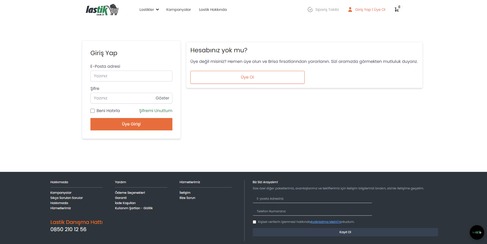
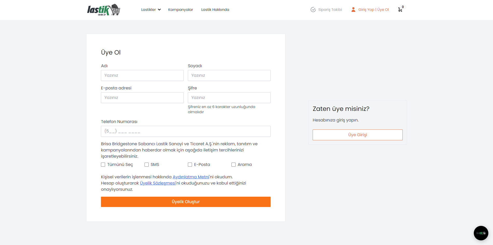

# Lastik Marketi
- Lastik.com.tr klon websitesi olarak geliştirilmiştir.
- Projede MERN yığını kullanılmıştır.
- Kullanıcı ve lastik bilgileri MongoDB Atlas veritabanında tutulmaktadır.
- Chatbot Dialogflow kullanılarak üretilmiştir.
- Chatbotun cevap verebileceği tüm soruları öğrenmek için "neler biliyorsun" sorusunu sorabilirsiniz.

## Anasayfa

## Giriş Yap

## Üye Ol

## Lastik Hakkında

## Lastik Türleri

